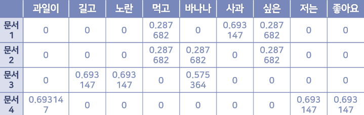

# AI 개발실무 레포트

## 미래학과 202010687 최요한
## 2023.06.10

레벤슈타인 거리를 이용한 챗봇 구하기

14주차 실습 자료를 참고하여,
기존 TF-IDF와 Consine Similarlity를 이용해 챗봇을 구현한 코드를

레벤슈타인 거리를 기반으로 한 챗봇으로 수정하여 구현하시오.

학습 데이터 : 14주차 실습 데이터에 포함된 ChatbotData.csv

과제 상세 설명:  

1. 학습데이터의 질문과 chat의 질문의 유사도를 레벤슈타인 거리를 이용해 구하기

2. chat의 질문과 레벤슈타인 거리와 가장 유사한 학습데이터의 질문의 인덱스를 구하기

3. 학습 데이터의 인덱스의 답을 chat의 답변을 채택한 뒤 출력


참고 : 기말고사와 제출기한이 겹치는 대신 기말고사의 부담을 줄이기 위해 10문항으로 출제됩니다.

과제 제출방법: 과제를 구현한 코드를 본인의 github에 올린뒤, github의 주소를 과제로 제출하기

과제 조건

1. 코드에 대한 상세한 주석달기 (올바르게 작동되는 코드와 주석을 모두 제출했다면 100점)

2. gihub을 이용하지 못하는 학생은 워드 파일로 코드와 결과 화면 캡처후 제출 (부분 점수 80점)

3. 코드가 돌아가지 못하면 돌아가지 못하는 부분에 대한 주석을 달고 부분점수 획득 가능

3. 절대로 타인과 과제를 공유하지 말 것 (캡처본 파일을 검사하여 동일 파일일 경우 0점 처리)


6. 과제를 제대로 수행하지 못했지만, 제출만 했을 경우, 제출 점수 20점


# 챗봇

## TF-IDF와 Cosine Similarity를 이용한 챗봇 구현

- 학습 데이터 셋 출처: (https://github.com/songys/Chatbot_data)



- TF-IDF 벡터화와 Cosine Similarity

- scikit-learn 설치

```
pip install scikit-learn
```

- cosine_similarity.py

```
from sklearn.feature_extraction.text import TfidfVectorizer
from sklearn.metrics.pairwise import cosine_similarity

# TfidfVectorizer 객체 생성
vectorizer = TfidfVectorizer()

# 한국어 문장들
sentence1 = "저는 오늘 밥을 먹었습니다."
sentence2 = "저는 어제 밥을 먹었습니다."

# 문장들을 벡터화
tfidf_matrix = vectorizer.fit_transform([sentence1, sentence2])

# 문장1과 문장2의 코사인 유사도 계산
cosine_sim = cosine_similarity(tfidf_matrix[0:1], tfidf_matrix[1:2])

print(f"문장 1: {sentence1}")
print(f"문장 2: {sentence2}")
print(f"두 문장의 코사인 유사도: {cosine_sim[0][0]}")

```

- 챗봇 구현

- chatbot.py 

```
import pandas as pd

# sklearn라는 머신러닝 라이브러리에서 TfidfVectorizer와 cosine_similarity를 불러옴
# TfidfVectorizer는 문서의 텍스트 데이터를 벡터 형태로 변환하는데 사용하며, cosine_similarity는 두 벡터 간의 코사인 유사도를 계산
from sklearn.feature_extraction.text import TfidfVectorizer
from sklearn.metrics.pairwise import cosine_similarity

# 챗봇 클래스를 정의
class SimpleChatBot:
    # 챗봇 객체를 초기화하는 메서드, 초기화 시에는 입력된 데이터 파일을 로드하고, TfidfVectorizer를 사용해 질문 데이터를 벡터화함
    def __init__(self, filepath):
        self.questions, self.answers = self.load_data(filepath)
        self.vectorizer = TfidfVectorizer()
        self.question_vectors = self.vectorizer.fit_transform(self.questions)

    # CSV 파일로부터 질문과 답변 데이터를 불러오는 메서드
    def load_data(self, filepath):
        data = pd.read_csv(filepath)
        questions = data['Q'].tolist()
        questions = data['A'].tolist()
        return questions, answers

    # 입력 문장에 가장 잘 맞는 답변을 찾는 메서드, 입력 문장을 벡터화하고, 이를 기존 질문 벡터들과 비교하여 가장 높은 유사도를 가진 질문의 답변을 반환함
    def find_best_answer(self, input_sentence):
        # 사용자 입력 문장을 벡터화
        input_vector = self.vectorizer.transform([input_sentence])
        # 사용자 입력 벡터와 기존 질문 벡터들 간의 코사인 유사도를 계산
        similarities = cosine_similarity(input_vector, self.question_vectors)
        # 가장 유사도가 높은 질문의 인덱스를 찾음
        best_match_index = similarities.argmax()
        # 가장 유사한 질문에 해당하는 답변을 반환
        return self.answers[best_match_index]

# 데이터 파일의 경로를 지정합니다.
filepath = 'ChatbotData.csv'

# 챗봇 객체를 생성합니다.
chatbot = SimpleChatBot(filepath)

# '종료'라는 입력이 나올 때까지 사용자의 입력에 따라 챗봇의 응답을 출력하는 무한 루프를 실행합니다.
while True:
    input_sentence = input('You: ')
    if input_sentence.lower() == '종료':
        break
    response = chatbot.find_best_answer(input_sentence)
    print('Chatbot:', response)

```